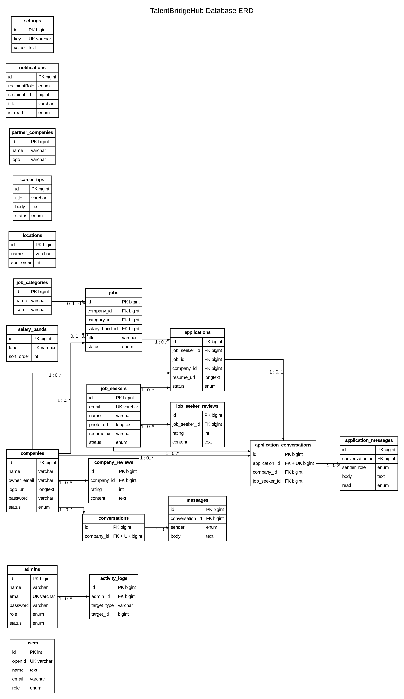

# TalentBridgeHub Entity Relationship Diagram

## Database ERD

This is the **database ERD for TalentBridgeHub**, generated from `drizzle/schema.ts`. It shows the actual database tables, important primary-key and foreign-key fields, and the relationships declared in the schema.

The visual version uses a **white background**, **black entity boxes**, **black text**, and **straight orthogonal relationship lines**. It is an ERD only; it does not use UML class notation.

[Open the full-size ERD image](ERD.png)

[Open the editable Graphviz ERD source](talentbridgehub-erd.dot)

## Relationship key

- `PK` means primary key.
- `FK` means foreign key.
- `UK` means unique key.
- The labels on the relationship lines show the cardinality from the parent table to the child table. For example, `1 : 0..*` means one parent record can have zero or many child records.

## Database relationships

| Parent table | Child table | Relationship | Foreign-key field |
|---|---|---|---|
| `companies` | `jobs` | One company can post zero or many jobs | `jobs.company_id` |
| `job_categories` | `jobs` | One category can classify zero or many jobs; the category is optional on a job | `jobs.category_id` |
| `salary_bands` | `jobs` | One salary band can group zero or many jobs; the salary band is optional on a job | `jobs.salary_band_id` |
| `job_seekers` | `applications` | One job seeker can submit zero or many applications | `applications.job_seeker_id` |
| `jobs` | `applications` | One job can receive zero or many applications | `applications.job_id` |
| `companies` | `applications` | One company owns zero or many applications | `applications.company_id` |
| `companies` | `company_reviews` | One company can receive zero or many reviews | `company_reviews.company_id` |
| `job_seekers` | `job_seeker_reviews` | One job seeker can receive zero or many reviews | `job_seeker_reviews.job_seeker_id` |
| `companies` | `conversations` | One company can have zero or one administrator conversation | `conversations.company_id` |
| `conversations` | `messages` | One conversation can contain zero or many messages | `messages.conversation_id` |
| `applications` | `application_conversations` | One application can have zero or one private employer–candidate conversation | `application_conversations.application_id` |
| `companies` | `application_conversations` | One company can have zero or many application conversations | `application_conversations.company_id` |
| `job_seekers` | `application_conversations` | One job seeker can have zero or many application conversations | `application_conversations.job_seeker_id` |
| `application_conversations` | `application_messages` | One application conversation can contain zero or many private messages | `application_messages.conversation_id` |
| `admins` | `activity_logs` | One administrator can create zero or many activity records | `activity_logs.admin_id` |

The `conversations.company_id` field is both a foreign key and unique. This database constraint ensures that a company has at most one administrator conversation.

`application_conversations` is deliberately separate from the administrator support conversation. A company opens at most one private conversation for each submitted application; the unique `application_id` field prevents duplicate threads. The table also stores the company and job-seeker foreign keys so that each role can be authorised directly against the conversation. `application_messages` stores the message text, sender role, read state, and creation time. A job seeker is shown a reply option only after the company has opened the application conversation.

## Tables without direct foreign-key lines

The `users` table supports the managed OAuth identity and is separate from the role-specific account tables. The `locations` table supplies managed filter values, while the current `jobs.location` field stores the selected location as text, so no foreign key is declared between these tables.

`notifications` uses `recipientRole` and `recipient_id` because one notification can target an administrator, job seeker, or company. `activity_logs.targetType` and `activity_logs.targetId` identify different types of target records. These are application-level polymorphic references rather than ordinary database foreign keys, so they are not drawn as direct relationship lines.

`partner_companies`, `career_tips`, and `settings` support public content and platform configuration. They do not have foreign-key relationships to the central recruitment workflow in the current schema.

## Source mapping

| Database table | Main purpose |
|---|---|
| `users` | Managed OAuth identities |
| `admins` | Administrator accounts and permissions |
| `job_seekers` | Candidate accounts and profiles |
| `companies` | Employer accounts and approval status |
| `jobs` | Vacancy postings |
| `applications` | Candidate applications to vacancies |
| `job_categories` | Vacancy category reference data |
| `locations` | Location filter reference data |
| `salary_bands` | Salary filter reference data |
| `company_reviews` | Reviews about companies |
| `job_seeker_reviews` | Reviews about job seekers |
| `conversations` | Administrator–company conversation threads |
| `messages` | Messages inside conversations |
| `application_conversations` | Private thread attached to one job application |
| `application_messages` | Messages exchanged by the company and job seeker for that application |
| `career_tips` | Draft and published career content |
| `partner_companies` | Curated public partner records |
| `activity_logs` | Administrator action audit records |
| `notifications` | Role-targeted system notifications |
| `settings` | Site-wide key/value settings |

The authoritative implementation remains `drizzle/schema.ts`; this ERD is a visual representation of that schema.

## Reference

[1]: https://graphviz.org/documentation/ "Graphviz documentation"
